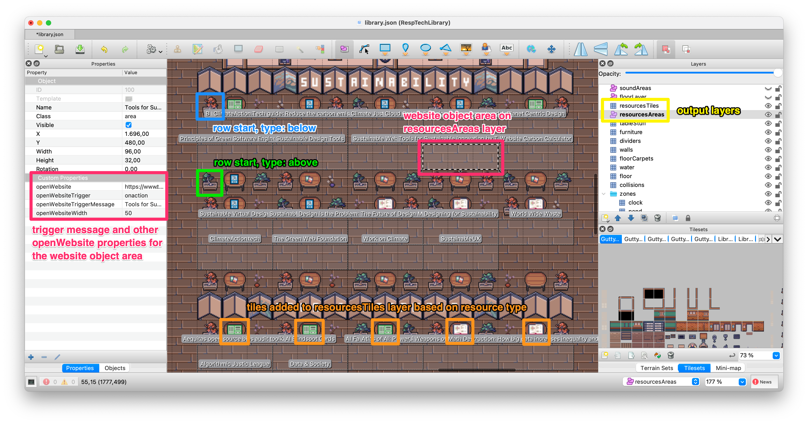

# About this script

This simple script was written to auto-populate resource layers in the Responsible Tech Library map used in [WorkAdventure](https://workadventu.re/). The map was built in [Tiled map editor](https://www.mapeditor.org/).

## What the script does

The script generates map data for two layers:

- an **object layer** we named `resourcesAreas` where rectangles with the class area and various openWebsite properties are defined (see the [WorkAdventure documentation](https://workadventu.re/map-building/opening-a-website.md) for info on these custom properties),
- a **tile layer**  we named `resourcesTiles` where tiles representing different resource tiles are drawn on top of existing table tiles in the map (see the [Tiled documentation](https://doc.mapeditor.org/en/stable/reference/json-map-format/) if you need more info on various layer properties).

Both layers should be created in advance in Tiled, so you can ensure the tiles are drawn where you need them (e.g., on top of the furniture layer, where you have tiles with tables).

The script makes certain assumptions about how rows with resources are designed: there's a tile representing a table in the middle, where we want to show a tile corresponding to resource type, and we want to draw a website object area either below or above the table and two adjacent tiles. Currently, all rows have the same number of tables, but that can be changed by adding tablesRow as a property in the `rows.json` file and ensuring the property is used when making the appropriate calculations.

Here's an annotated example of how the generated layers appear in Tiled:

## Source files

The script uses data from two .json files when generating map data:

- `resources.json`: defines resources in 5 pre-defined categories. Each resource has a title, url, optional description, and type property.
- `rows.json`: defines the start of rows that are available in each of the 5 pre-defined categories. The starting point is defined by the x, y map coordinates of the first tile of the row (where the plants are positioned), while the type (`"below"` | `"above"`) lets the script know whether the website area object (a rectangle) should be drawn below the row with the table and decoration tiles or above it. 

Currently the 5 categories are pre-defined in an array in the script, but that might change in the future.

## Running the script

Make sure the map properties match your set up and run the script. An easy way to do so is to run `node generateLayers.js` in your VS Code Terminal. Open the output .json map in Tiled to check whether the generated layers match your expectations.

## Other notes

Feel free to re-use any part of the script in your own project, but keep in mind that this wasn't designed as a general tool. We recommend using a test map file during development, so you don't accidentally corrupt your main map file. Eventually, we might make this part of the build process for the Library map, but as we expect the resources to be relatively static, we are keeping it as a separate script for now. 
